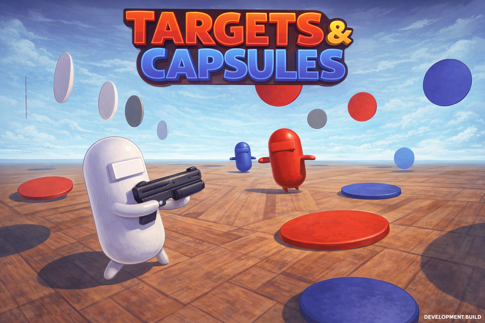
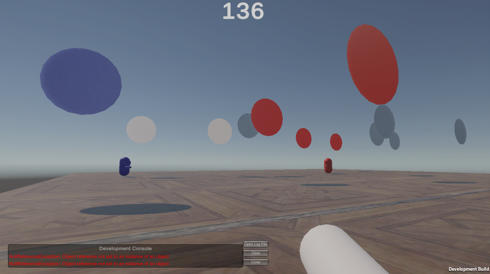
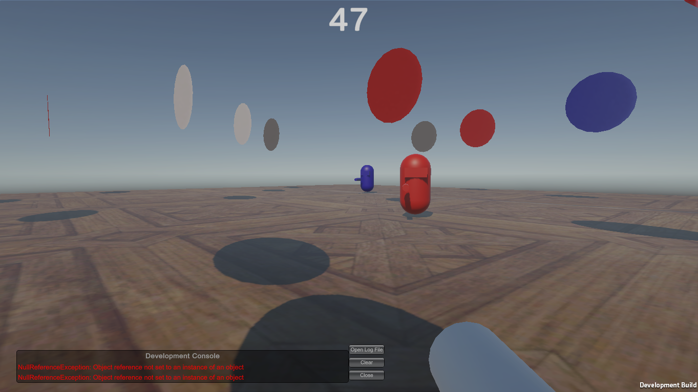

# 🌐 MUSK Multiplayer Project 🎮
⚠️ This is a project to learn how works the multiplayer using in this case Photon.
It's just a demo
--- 

## Ready?
Paint all the disks and get the victory! You have got 6 bullets and if you finished them, don't wory! 
Find you ammo to get 6 more bullets and paint it!

## How To play
- Use AWSD to move the player
- Use the mouse to control the camera
- Click mouse button to shoot
- Walk to the ammo and "touch" it to take it

## How can i win?
When the time finish, the palyer with more targts, win!

---
⚙️ Unity Version: Unity 6.2 (6000.2.10f1)
